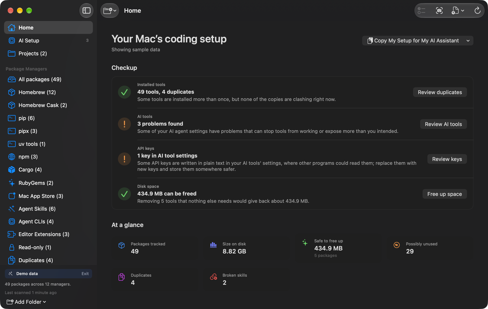

# Installory

**The safe, read-only checkup for a Mac you code on with AI.**

[Mac App Store](https://apps.apple.com/us/app/installory/id6772879429?mt=12) ·
[installory.app](https://installory.app/) · Free · MIT · macOS 14+

Installory shows what is installed on your Mac, what your AI coding tools
installed and changed, and what is safe to clean up. It reads Homebrew formulae
and casks, pip, pipx, persistent uv tools, npm, Cargo, RubyGems, receipt-bearing
Mac App Store apps, and your AI tools: Claude Code and opencode skills, agent
CLIs, VS Code and Cursor extensions, and the MCP servers, instruction files and
permission settings those tools use. It never changes anything, never runs a
command, and never sends your data anywhere: it has no internet code of its
own.

<!-- TODO: these screenshots predate the new checkup Home and the AI Setup
screen. Replace them before the next release (see docs/app-store-listing.md
for the screenshot plan). -->


## Capabilities

The items marked *new* are in the next release (unreleased; proposed 1.6.0).

- **Home checkup** *(new)*: four plain-English rows, each marked good, worth a
  look, or not checked yet, with an at-a-glance grid below:
  - **Installed tools:** how many tools you have, duplicates, and items to review.
  - **AI tools:** what your AI assistants installed and how their setup looks.
  - **Secrets in AI tool settings:** API keys or passwords written in plain
    text in AI tool config files.
  - **Space:** size on disk and what is safe to free up.
- **AI Setup audit** *(new)*: a read-only review of your AI coding setup.
  - MCP servers declared in Claude Code, Claude Desktop, Cursor, VS Code, Codex
    and opencode, at user and project level. Flags the same server set up
    differently in different places, servers whose program is missing,
    servers that connect over the internet, turned-off servers, and API keys
    written directly into a server's settings.
  - Instruction files your agents load into every conversation: `CLAUDE.md`,
    `CLAUDE.local.md`, `AGENTS.md`, `GEMINI.md`, Cursor rules, GitHub Copilot
    instructions and Windsurf rules. Flags broken shortcuts, very large files,
    the older `.cursorrules` file, and projects whose `AGENTS.md` Claude Code
    does not read.
  - Permissions and hooks for Claude Code and Codex: "run anything without
    asking" modes, a turned-off warning for skip-permissions mode, broad
    allow rules, commands approved with "don't ask again", commands that run
    automatically through hooks, and projects that can start their own MCP
    servers.
  - Each finding has a plain-English explanation, a suggested fix, and an
    ask-your-agent prompt. Secret values are masked; only the key name and
    file are shown.
- **Ask your AI assistant** *(new)*: from a package, a duplicate group, a
  cleanup selection, or a finding, copy a ready-made prompt for Claude Code,
  Codex, or any assistant. Every prompt asks the agent to explain each command
  and wait for your OK. Paths under your home folder are shown as `~/…`.
  Installory only puts the text on your clipboard; it never sends it anywhere.
- **Copy My Setup for My AI Assistant** *(new)*: copies a short summary of your
  installed tools so your assistant's advice fits your Mac. Available from
  Home, the menu bar, and Settings.
- **First-run guide** *(new)*: five steps. It asks for your home folder (read
  only) and lists what Installory reads (package folders, AI tool settings,
  editor extensions) and which folders it doesn't open (Documents, Photos,
  Mail, browser data, passwords and keychain). That is a promise kept in code:
  the macOS home-folder grant itself is broad. Homebrew outside your home folder is a separate,
  optional grant. "Explore with Sample Data" works without any folder access.
- **Install history** (formerly "provenance"): optional and off by default.
  Matches each tool to the shell command or the Claude Code, Codex or opencode
  session that installed it, from local shell history and session records.
  Turn it on in onboarding or Settings → Privacy.
- **Removal-safety verdicts** (safe / remove with care / leave alone) per
  package, from reverse-dependency analysis, orphan detection, read-only and
  denylist status.
- **Restore points and Move to Trash:** bulk cleanup captures a snapshot first
  and offers a restore script; file-backed items can be moved to Trash instead
  of removed.
- **Free-up-space bundle:** the safe, visible, removable packages with the most
  reclaimable space.
- **Project workspaces:** stale local projects found in granted folders, sized
  and sorted by last activity. Never modified.
- **Plain-language labels** *(new)*: Possibly Unused (was Review Candidates), Saved Setup
  (was Baseline), Size on disk (was Measured payload), Install History, and
  "Runs first" / "Hidden by another copy" for duplicates on your PATH.
- Unified List and sortable Table views with search by name, scope, or path.
  Command-F (Edit → Find Packages) focuses search.
- Plain-English descriptions for every package, including agent skills, CLIs
  and editor extensions, plus install timing, dependencies, a
  reverse-dependency tree, and bounded size measurements when available.
- Cross-manager duplicate analysis, review candidates, cleanup scoring, and a
  Size on disk view.
- Hide, pin, and annotate packages.
- Snapshots, Saved Setup compare with change detection and reinstall scripts,
  and CSV, Markdown, JSON, and environment-report exports.
- **Cleanup scripts you review and run yourself.** Single or bulk. Bulk cleanup
  snapshots first; single-package scripts follow the Always / Ask / Never
  snapshot preference. *New:* every command runs inside a `( … )` subshell so
  pasting a script cannot change or close your Terminal session, and each
  script sheet has a "How to run this" section.


## Safety guarantees

- **Read-only scanning:** Installory never installs, removes, or changes software.
- **No command execution:** production code contains no subprocess calls.
- **No runtime network:** package descriptions are bundled with the app.
- **Sandboxed access:** external folders require user-granted, read-only,
  security-scoped bookmarks. Read-write access applies only to a destination the
  user selects in a Save panel.
- **AI tool settings stay private:** from `~/.claude.json`, Installory keeps
  only MCP server entries. It never keeps or shows the sign-in, account,
  history or other data stored in that file.
- **Secrets are masked at parse time:** API keys, tokens and passwords found in
  AI tool config files are masked as soon as the file is read (first four
  characters at most). The raw value is never stored, exported, or put in a
  copied prompt.
- **Local privacy:** install history is off by default, redacted before it is
  stored, and never leaves the Mac.

CI enforces the no-subprocess, no-networking, entitlement and read-only
bookmark boundaries with `scripts/check-invariants.sh`. See
[docs/ARCHITECTURE.md](docs/ARCHITECTURE.md) for how the pieces fit together.

## Build and test

Installory runs on macOS 14 or newer. Building requires Xcode 16.3 or newer on a
macOS release supported by that Xcode, plus
[XcodeGen](https://github.com/yonaskolb/XcodeGen):

```bash
brew install xcodegen
./scripts/regenerate-xcode.sh
open Installory.xcodeproj
```

Select a Development Team in Xcode before running the app. The generated
`Installory.xcodeproj` is intentionally ignored; `project.yml` is the source of
truth and must be regenerated after app-target files are added, moved, or
renamed.

Run the Core suite without Xcode:

```bash
cd Installory
swift test
```

CI runs XCTest and Swift Testing separately with
`swift test --no-parallel --disable-swift-testing` and
`swift test --no-parallel --disable-xctest`.

Run the app suite without signing:

```bash
./scripts/regenerate-xcode.sh
xcodebuild \
  -project Installory.xcodeproj \
  -scheme Installory \
  -destination 'platform=macOS' \
  CODE_SIGNING_ALLOWED=NO \
  CODE_SIGNING_REQUIRED=NO \
  test
```

Check the product invariants:

```bash
./scripts/check-invariants.sh
```

The offline description corpus has its own
[maintenance runbook](scripts/generate-descriptions/README.md).

## Structure

- `Installory/` — standalone Swift package (`InstalloryCore`) containing
  scanners, models, persistence, install history, the AI setup audit
  (`AgentConfig/`), checkup and prompt building (`Guidance/`), snapshots,
  exports, and script generation.
- `App/Sources/` — SwiftUI shell and `AppCoordinator` integration layer.
- `App/Resources/` — app assets, privacy manifest, legal notices, and bundled
  descriptions.
- `project.yml` — XcodeGen source of truth.
- `.github/workflows/test.yml` — Core, app, Release-build, and invariant gates.
- `docs/` — [architecture](docs/ARCHITECTURE.md) and the
  [App Store listing draft](docs/app-store-listing.md).

The only package dependency is GRDB, pinned to the 7.10 minor series. New
scanners must remain filesystem-only; managers that require executing a command
are deliberate gaps.

### Notes for contributors

- Use `UserHome.directory` for the user's home folder, never
  `FileManager.default.homeDirectoryForCurrentUser` or `NSHomeDirectory()`.
  Inside the App Sandbox those return the app container
  (`~/Library/Containers/<bundle-id>/Data`), so scanners silently find nothing.

## Release

Draft notes for the next release (unreleased; proposed 1.6.0), the App Review
note, and the archive checklist are in [RELEASE.md](RELEASE.md). Historical
audits and implementation plans live in Git history rather than the working tree.

## License

Installory is available under the [MIT License](LICENSE). Bundled dependency and
asset notices are in `App/Resources/ThirdPartyNotices.txt`.
