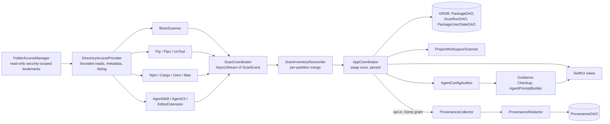

# Installory architecture

For engineers and reviewers. Describes the code as of 2026-10-05 on branch
`claude/installory-audit-features-33686e` (next release, unreleased; proposed
1.6.0). User-facing features are in [README.md](../README.md).

## Design rules

Everything below follows four rules. CI enforces the first two mechanically.

1. **No subprocesses.** Production Swift never calls `Process()`. Scanners
   learn everything from files on disk; a package manager that can only be
   queried by running it is a deliberate gap.
2. **No networking.** No `URLSession`, `URLRequest`, `Network.framework` or
   similar. Package descriptions are bundled (`descriptions.json`). The only
   thing that may go online is the system rating dialog (`requestReview`),
   which macOS runs, so user-facing copy says Installory "never sends your
   data anywhere and has no internet code of its own", not "never connects to
   the internet".
3. **Read-only.** The app never installs, removes or edits anything. Cleanup is
   a generated script the user reads and runs. Writes happen only to the app's
   own database and to a destination the user picks in a Save panel.
4. **Bounded and private.** Every file read has a byte limit. Data from shell
   history, agent logs and AI tool configs is redacted or masked before it is
   stored or shown.

## Package layout

```
Installory/                     Swift package "InstalloryCore" (no UI, no AppKit)
  Sources/InstalloryCore/
    Foundation/                 DirectoryAccessProvider, UserHome, PathDiscovery,
                                bounded readers/sizers, Python discovery
    Scanners/                   one PackageScanner per manager, ScanCoordinator,
                                ScanInventoryReconciler, ProjectWorkspaceScanner
    Models/                     Package, RemovalSafety, duplicates, FreeUpSpace,
                                AIAttribution, analyses
    Persistence/                GRDB Database, Migrations (v1–v4), DAOs
    Provenance/                 shell/agent-log collectors, InstallCommandDetector,
                                ProvenanceCollector, ProvenanceRedactor,
                                NarrativeRenderer  (user-facing name: Install History)
    AgentConfig/                AI Setup audit: MCP servers, instruction files,
                                permissions, findings, secret masking, mini TOML parser
    Guidance/                   Checkup (Home rows), AgentPromptBuilder,
                                HomePathRedactor
    Cleanup/                    ScriptGenerator, ReinstallScriptGenerator,
                                ShellScriptHelpers, Denylist, ManagerBinaryResolver
    Snapshots/                  SnapshotManager, SnapshotDiff, Baseline (Saved Setup)
    Export/                     CSV/Markdown/JSON export, environment report
    Descriptions/ Demo/         bundled description lookup, sample data
  Tests/InstalloryCoreTests/    XCTest + Swift Testing, fixtures

App/
  Sources/                      SwiftUI app; AppCoordinator (@Observable,
                                main actor) owns state and calls Core;
                                FolderAccessManager owns bookmarks
  Tests/                        app-target tests (coordinator, onboarding,
                                Home checkup, canonical directories)
  Resources/                    assets, PrivacyInfo.xcprivacy, notices,
                                descriptions.json
project.yml                     XcodeGen source of truth (Installory.xcodeproj
                                is generated and gitignored)
scripts/check-invariants.sh     product invariant gate
```

The only dependency is GRDB (7.10.x).

## Scan pipeline



1. **Access.** `FolderAccessManager` (App) resolves the user's read-only
   security-scoped bookmarks and starts access. Core code never touches
   bookmarks; it reads through `DirectoryAccessProvider`
   (`SystemDirectoryAccessProvider` in production, in-memory fakes in tests).
   Reads take a byte limit and fail with `readLimitExceeded` rather than
   loading an unbounded file.
2. **Scanners.** Each `PackageScanner` reads one manager's on-disk metadata
   (Homebrew Cellar/Caskroom receipts, `dist-info`, `package.json`, Cargo's
   `.crates2.json`, gem specs, App Store receipts, `SKILL.md`, editor extension
   manifests) and returns `[Package]`. A scanner can manage more than one
   partition (`managedPackageManagers`).
3. **ScanCoordinator** runs scanners concurrently with timeouts and emits
   `scannerStarted`, `scannerFinished(manager, status, packages)` and
   `allFinished` events.
4. **ScanInventoryReconciler** merges each finished scanner into a
   double-buffer copy of the last-known inventory. A successful scanner
   replaces only the partitions it observed; a failed, skipped or timed-out
   scanner keeps its old partition, so a hiccup never looks like a mass
   uninstall and never cascades deletes into install history.
5. **AppCoordinator** swaps the new inventory in once, persists it with
   `PackageDAO.replaceAll` and a `ScanRun` record, takes the automatic
   first-scan snapshot, then runs project-workspace discovery (in memory only)
   and, last, install history.
6. **Analyses** (removal safety, duplicates, Possibly Unused, Free-up-space
   bundle, Size on disk, agent-stack health) are pure functions over the
   inventory and are recomputed from it, not stored.

### Install history (provenance) pipeline

Off by default. Runs only when the user turns it on and a bookmark covers the
real home folder, and only after packages are saved (evidence rows reference
`packages.id`).

```
ShellHistoryCollector  ClaudeCodeLogCollector  CodexLogCollector  OpenCodeLogCollector
            \                    |                     |                 /
             +-----> InstallCommandDetector (install commands only) <---+
                                   |
                     ProvenanceCollector (bucket by manager + name,
                                   match by scope and time)
                                   |
                     ProvenanceRedactor (credentials, home path, length caps)
                                   |
                     ProvenanceDAO  -->  NarrativeRenderer / AIAttribution
```

`wasInstalledByAIAssistant` and `AgentAttribution` label a package as installed
by Claude Code, Codex or opencode. Absence of evidence means "unknown", never
"installed by you".

## AI Setup audit (`AgentConfig/`)

`AgentConfigAuditor.audit()` is pure, synchronous and read-only. It takes the
real home directory and the granted project roots as inputs and reads through
`DirectoryAccessProvider` with per-file limits (2 MB for config and instruction
files, 16 MB for `~/.claude.json`, plus caps on projects, servers, rules and
hooks).

| Collector | Reads |
|---|---|
| `MCPServerCollector` | `~/.claude.json` (only `mcpServers` and per-project MCP keys), Claude Desktop `claude_desktop_config.json`, `~/.cursor/mcp.json`, VS Code `mcp.json`, `~/.codex/config.toml` `[mcp_servers]`, opencode `opencode.json(c)`; per project `.mcp.json`, `.cursor/mcp.json`, `.vscode/mcp.json`, `opencode.json(c)` |
| `InstructionFileCollector` | global `~/.claude/CLAUDE.md`, `~/.codex/AGENTS.md`, `~/.config/opencode/AGENTS.md`, `~/.gemini/GEMINI.md`; per project `CLAUDE.md`, `CLAUDE.local.md`, `.claude/CLAUDE.md`, `AGENTS.md`, `GEMINI.md`, `.cursorrules`, `.cursor/rules/*.md(c)`, `.github/copilot-instructions.md`, `.windsurfrules` |
| `PermissionProfileCollector` | `~/.claude/settings.json`, project `.claude/settings.json` and `.claude/settings.local.json`, Codex `config.toml` |

`AgentConfigFindingRules` turns the collected data into `AgentConfigFinding`s
with a severity (info / warning / critical), a category (MCP servers,
instructions, permissions, config files), a plain-English explanation and fix.
Examples: a server defined differently in two places, a missing server program
(looked up in Homebrew, `/usr/local/bin`, `~/.local/bin`, `~/.cargo/bin`,
`~/.bun/bin`, `~/.volta/bin` and `~/.nvm` node versions, without running
anything), remote servers, literal secrets, broken instruction-file symlinks,
oversized instruction files, `AGENTS.md` not read by Claude Code, "run any
command without asking" modes, broad allow rules, auto-running hooks.

**Secret handling.** `AgentConfigSecretMasker` masks at parse time: values
under keys containing KEY / TOKEN / SECRET / PASSWORD / AUTH, values matching
well-known token formats (`sk-…`, `ghp_…`, `xox…-`, `AKIA…`, JWTs and others),
secret-looking CLI flags and URL query parameters. A masked value keeps at most
the first four characters. Environment references such as `${GITHUB_TOKEN}` or
`{env:TOKEN}` are kept verbatim because they are not secrets. Permission rules
and hook commands go through `redactCommand`. Raw values never leave the
collector. `~/.claude.json` is decoded, the MCP keys are plucked, and the rest
(account, history, caches) is discarded immediately.

The app screen that presents these findings ("AI Setup") and the Home
checkup's AI-tools and secrets rows are being wired up in this release; until
then `AppCoordinator` passes `agentFindings: nil` and the rows show "not
checked".

## Guidance (`Guidance/`)

- **`Checkup`** turns plain counts (`CheckupInput`) into four `CheckupRow`s for
  Home: installed tools, AI tools, secrets, space. Each row is `good`,
  `attention` or `unknown`, and coverage gaps (no home grant, check disabled)
  produce `unknown` with a sentence saying what to grant, rather than a false
  "all good".
- **`AgentPromptBuilder`** builds copyable prompts: removal, duplicate,
  cleanup, finding, and the setup summary ("Copy My Setup", capped at 4,000
  characters by default). It is pure (no filesystem, process or network). Every
  prompt ends with fixed guardrails (explain each command and wait for OK; no
  `sudo`, `--break-system-packages` or `rm -rf` without asking; make changes
  reversible). The `.exposedSecret` finding kind has no field for a value, only
  a sanitized key name and file paths, so a secret cannot reach the clipboard
  through it.
- **`HomePathRedactor`** renders paths under home as `~/…` in prompts and
  reports.

The App's `AskAgentButton` copies the prompt to the pasteboard. Nothing is sent.

## Cleanup script generation (`Cleanup/`)

`ScriptGenerator` produces a Bash script for single or bulk removal; the user
reviews it in a sheet, then copies or saves it. Installory never runs it.

- `ManagerBinaryResolver` targets the exact manager client per installation
  (for example the specific Python interpreter or npm prefix), grouped by
  `Package.qualifier`.
- `Denylist` keeps system-critical packages out as comments.
- Strategies: uninstall via the manager, or Move to Trash for file-backed
  items; `isRemovalScriptEligible(strategy:)` decides per package, and
  comment-only rows are not eligible.
- Every executable line runs inside a `( … )` subshell with strict mode, so a
  failing command ends only the subshell and pasting cannot change or close
  the user's shell. The script sheet adds a "How to run this" section that
  recommends saving the file and running it with `bash`.
- Bulk cleanup takes a snapshot first; `ReinstallScriptGenerator` produces the
  matching restore script.

## Sandbox and bookmarks

- Entitlements are exactly: `app-sandbox`, `files.bookmarks.app-scope`, and
  `files.user-selected.read-write` (Save panel destinations only).
- Scanning bookmarks are created with `.securityScopeAllowOnlyReadAccess`.
- **Real-home pitfall.** In the sandbox,
  `FileManager.default.homeDirectoryForCurrentUser` and `NSHomeDirectory()`
  return `~/Library/Containers/<bundle-id>/Data`. Code that builds
  `~/.claude`, `~/.cargo` or `~/.nvm` from them finds nothing, silently. Always
  use `UserHome.directory`, which reads the account's home from `getpwuid`.
  Knowing the path grants no access; reads still need a bookmark that covers
  it. Core types take the home directory as an injected parameter so tests can
  point them at fixtures.
- Onboarding asks for the home folder (and, separately, Homebrew's prefix when
  it is outside home) and shows a "Reads / Doesn't open" list (a code-level promise; the home grant itself is broad).

## Invariants and CI

`scripts/check-invariants.sh` fails the build when:

- `Process(` appears in non-comment Swift under `Installory/Sources` or
  `App/Sources`;
- networking APIs appear (`URLSession`, `URLRequest`, `URLProtocol`,
  `NWConnection`, `NWListener`, `NWBrowser`, `NWPathMonitor`, `CFNetwork`,
  `import Network`);
- the entitlements file or `project.yml` differs from the three approved keys;
- `FolderAccessManager` loses `.securityScopeAllowOnlyReadAccess`;
- `Installory.xcodeproj` is tracked in Git.

The check is pattern-based and skips comment-only lines; it is a tripwire, not
a proof. Code review still matters.

`.github/workflows/test.yml` runs on pushes to `main` and on pull requests
(macOS 15 runners):

- **InstalloryCore job:** invariants, `swift build`, XCTest
  (`--disable-swift-testing`), then Swift Testing (`--disable-xctest`), both
  with `--no-parallel`.
- **InstalloryApp job:** pinned, checksum-verified XcodeGen; regenerate the
  project; invariants again; Debug app tests unsigned; unsigned Release build.

## Testing strategy

- **Core** (as of 2026-10-06: 914 tests): scanners and auditors run against
  fixture trees through in-memory `DirectoryAccessProvider` fakes, never the
  developer's real home. AgentConfig has fixture configs for every supported
  client (`Fixtures/agent-config/`), including secrets that must come out
  masked. Other suites cover reconciliation, migrations, provenance matching
  and redaction, script output (subshell wrapping, eligibility), prompt
  guardrails and redaction, checkup rows, and `UserHome`.
- **App** (as of 2026-10-06: 81 tests): coordinator persistence, onboarding
  flow and access plan, Home checkup mapping, canonical directories.
- **Manual:** a signed, sandboxed build with a real home-folder grant is the
  only way to exercise bookmarks end to end; see the hands-on step in
  [RELEASE.md](../RELEASE.md).
